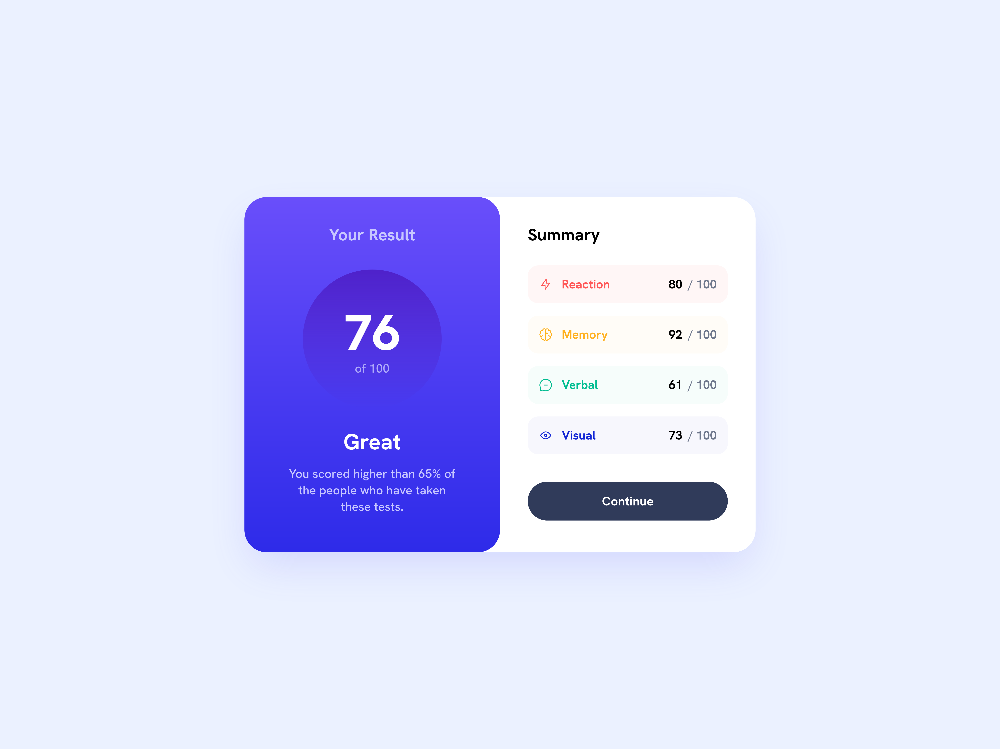

# Frontend Mentor - Social links profile solution

This is a solution to the [Results summary component challenge on Frontend Mentor](https://www.frontendmentor.io/challenges/results-summary-component-CE_K6s0maV). Frontend Mentor challenges help you improve your coding skills by building realistic projects. 

## Table of contents

- [Overview](#overview)
  - [The challenge](#the-challenge)
  - [Screenshot](#screenshot)
  - [Links](#links)
- [My process](#my-process)
  - [Built with](#built-with)
  - [What I learned](#what-i-learned)
  - [Continued development](#continued-development)
  - [Useful resources](#useful-resources)
- [Author](#author)

## Overview

### The challenge

Users should be able to:

- See hover and focus states for all interactive elements on the page

### Screenshot

### Links

- Solution URL: [GitHub](https://github.com/marisudris/frontent-mentor-results-summary-component)
- Live Site URL: [GitHub Pages](https://marisudris.github.io/frontent-mentor-results-summary-component/)

## My process

### Built with

- Semantic HTML5 markup
- CSS custom properties
- Flexbox
- Grid
- Mobile-first workflow

### What I learned

Mostly how spacing can be hard to deal with - always take line-height into account, as a matter of fact, it might be the most important factor in spacing, since it's easy to forget to take it into account while trying
to adjust paddings or margins while wondering why it doesn't look right.

Doing transitions on hover states when the hover state has a gradient (by defintion a background image), but the base state has a solid color, can be a bit tricky. I used `::before` pseudo-element to create a gradient overlay on hover.

### Continued development

Account for and figure out proper line heights early next time.

### Useful resources

- [Clamp calculator](https://www.marcbacon.com/tools/clamp-calculator/) - This was useful for generating `clamp()` value for fluidly responsive card padding, instead of using media queries and "snappy" padding sizes.

- **Pixel Perfect Pro** add-on available for both Chrome and Firefox browsers. This was useful for making quicker comparisons between the design and my solution..
## Author

- Frontend Mentor - [@marisudris](https://www.frontendmentor.io/profile/marisudris)
